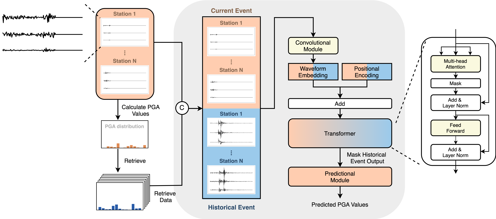

## Combining Retrieval-Augmented Generation (RAG) with Earthquake Research

This project explores the application of Retrieval-Augmented Generation (RAG) in the field of earthquake research. By leveraging RAG, we aim to enhance the accuracy and efficiency of earthquake-related predictions and data analysis. **Note:** This work is still in progress and has not yet been submitted for publication.

### Research Objective:
The goal of this project is to integrate RAG techniques with seismic data to improve the understanding and forecasting of earthquake events. This approach allows for more effective use of vast amounts of seismic data and enhances decision-making processes in earthquake prediction and analysis.

### Model Structure:
The proposed model architecture combines the power of retrieval-based methods with generation capabilities to better process and predict seismic events.

### Model Diagram:
Below is a visual representation of the model structure:

### Key Contributions:
- Integration of RAG with seismic data to enhance earthquake prediction performance.
- Efficient use of both historical and real-time seismic data to provide more comprehensive analysis.
- A novel approach to applying advanced AI techniques in the field of earthquake research.
